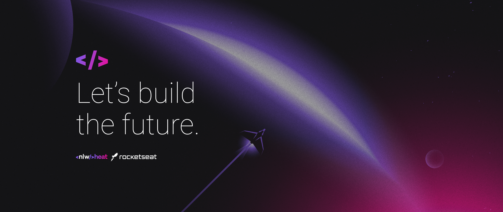
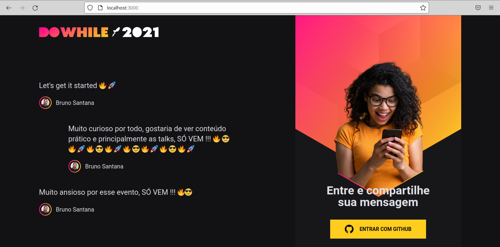
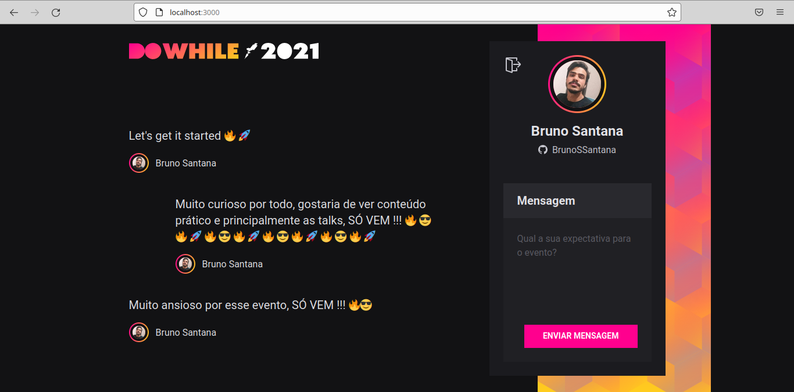
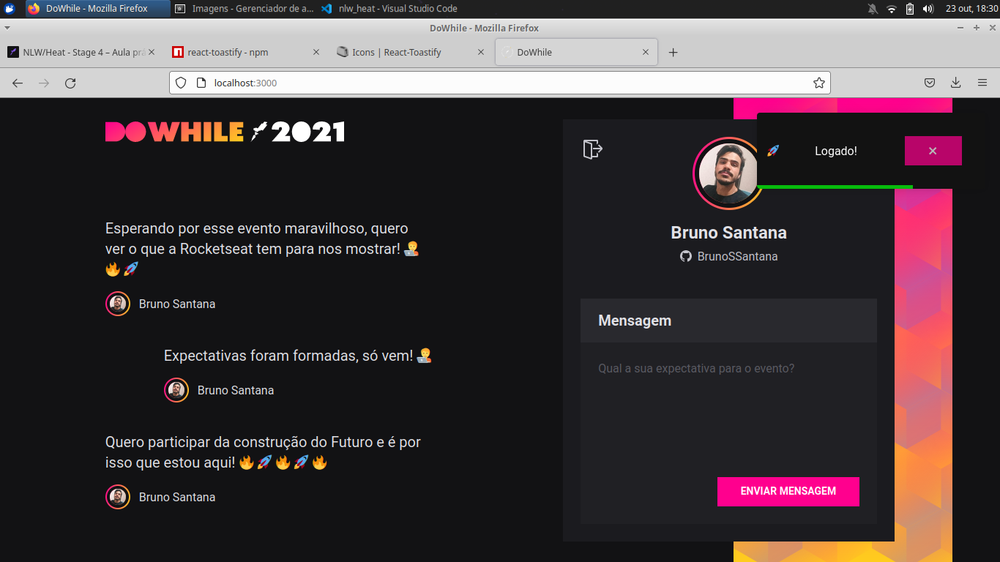
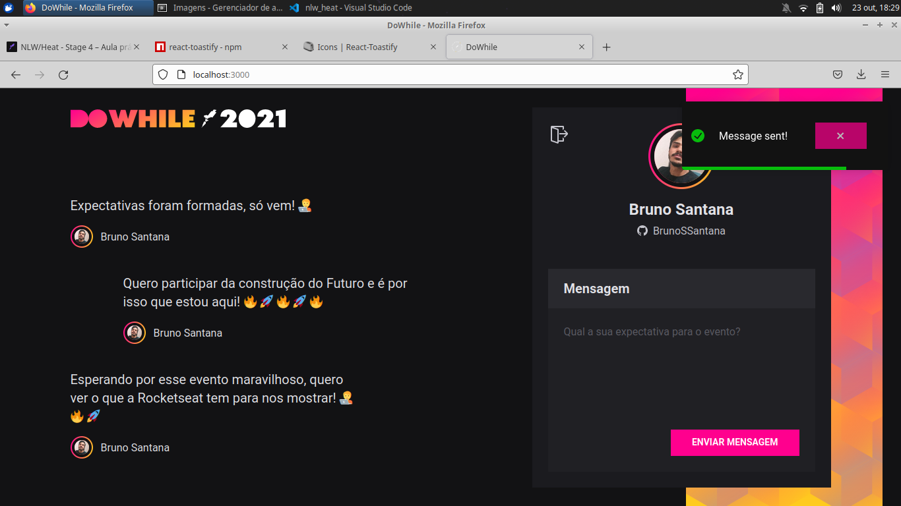

<h1 align="center">
	
</h1>

<h3 align="center">
  NLW HEAT
</h3>

<p align="center">
  

  <a href="https://www.linkedin.com/in/bruno-santanas/">
    
  </a>
  
  
  
  <a href="https://github.com/BrunoSSantana/nlw_heat/commits/master">
    
  </a>
  
  <a href="https://github.com/BrunoSSantana/nlw_heat/issues">
    
  </a>
  
  
</p>

<p align="center">
  <a href="#-about-the-project">About the project</a>&nbsp;&nbsp;&nbsp;|&nbsp;&nbsp;&nbsp;
  <a href="#-technologies">Technologies</a>&nbsp;&nbsp;&nbsp;|&nbsp;&nbsp;&nbsp;
  <a href="#-getting-started">Getting started</a>&nbsp;&nbsp;&nbsp;|&nbsp;&nbsp;&nbsp;
  <a href="#-license">License</a>&nbsp;&nbsp;&nbsp;|&nbsp;&nbsp;&nbsp;
  <a href="#-references">References</a>
</p>

<p id="insomniaButton" align="center">
  <a href="https://insomnia.rest/run/?label=node_heat&uri=https%3A%2F%2Fraw.githubusercontent.com%2FBrunoSSantana%2Fnlw_heat%2Fmaster%2Fdoc.json" target="_blank">
    
  </a>
</p>

<!--  -->

## 👨🏻‍💻 About the project

- <p style="color: purple;">Repository created during NLW Heat on the impulse track where we built a platform to gather feedback from events.</p>

**Page Login**

<p align="center">
  
</p>

**Page Send Message**

<p align="center">
  
</p>

**Notification Login**

<p align="center">
  
</p>

**Notification Message**

<p align="center">
  
</p>

**Mobile Unauthenticated**

<p align="center">
  
</p>

**Mobile Authenticated**

<p align="center">
  
</p>

## 🚀 Technologies

Technologies that I used to develop this api

- [Node.js](https://nodejs.org/en/)
- [ReactJS](https://reactjs.org/)
- [TypeScript](https://www.typescriptlang.org/)
- [React Native](https://reactnative.dev/)
- [Express](https://expressjs.com/pt-br/)
- [SQLite](https://www.sqlite.org/)
- [React Icons](https://react-icons.netlify.com/#/)
- [React-toastify](https://fkhadra.github.io/react-toastify/introduction)
- [Axios](https://github.com/axios/axios)
- [React Router DOM](https://reacttraining.com/react-router/)
- [Prisma](https://www.prisma.io/)
- [Vite](https://vitejs.dev/)
- [Socket.IO](https://socket.io/)
- [Expo](https://expo.io/)
- [Elixir](https://elixir-lang.org/)
- [Phoenix Framework](https://www.phoenixframework.org/)

## 💻 Getting started

Import the `Insomnia.json` on Insomnia App or click on [](https://insomnia.rest/run/?label=node_heat&uri=https%3A%2F%2Fraw.githubusercontent.com%2FBrunoSSantana%2Fnlw_heat%2Fmaster%2Fdoc.json)

### Requirements

- [Node.js](https://nodejs.org/en/)
- [Yarn](https://classic.yarnpkg.com/) or [npm](https://www.npmjs.com/)
- [Expo](https://docs.expo.dev/#quick-start)
- One instance of [PostgreSQL](https://www.postgresql.org/)
- Create acount [Expo.dev](https://expo.dev/)

#### Set Configurations Oauth Applications Web and Mobile
- Create 2 **New OAuth App** in [ Developer settings](https://github.com/settings/developers)
 - **OAuth for mobile**
 - Homepage URL: `https://auth.expo.io/@<user-expo>/<app-name>`
 - Authorization callback URL: `https://auth.expo.io/@<user-expo>/<app-name>`
 - Save Client ID and Client secrets, add in file .env
 - **OAuth for mobile**
 - Homepage URL: `http://localhost:3003`
 - Authorization callback URL: `http://localhost:3003`
 - Save Client ID and Client secrets, add in file .env

#### Clone the project and access the folder

**Clone by HTTPS:**

```bash
$ git clone https://github.com/BrunoSSantana/nlw_heat.git && cd nlw_heat
```

**Clone by GitHub CLI:**

```bash
$ gh repo BrunoSSantana/nlw_heat
```

**Follow the steps below**

### Backend

```bash
# Starting from the project root folder, go to node_heat folder
$ cd node_heat

# Install the dependencies
$ yarn

# Once the services are running, run the migrations
$ yarn prisma migrate dev

# To finish, run the api service
$ yarn dev
```
### Web

_Obs.: Before to continue, be sure to have the API running_

```bash
# Starting from the project root folder, go to web_heat folder
$ cd web_heat

# Install the dependencies
$ yarn

# Be sure the file 'src/services/api.ts' have the IP to your API

# Start the client
$ yarn dev
```

### Mobile

_Obs.: Before to continue, be sure to have the API running_

```bash
# Starting from the project root folder, go to app_heat folder
$ cd app_heat

# Install the dependencies
$ yarn

# Be sure the file 'src/services/api.ts' have the IP to your API

# Be sure to have the expo installed
# Start the application
$ expo start
```

### Microservice

*Obs.:Configure in tags_heat/config/dev.exs, the database*

```bash
# Starting from the project root folder, go to tags_heat folder
$ cd tags_heat

# Install the dependencies
$ mix deps.get

# Create and migrate your database
$ mix ecto.setup

# Start Phoenix endpoint
$ mix phx.server

# or inside IEx
iex -S mix phx.server
```

## 📝 License

This project is licensed under the MIT License - see the [LICENSE](LICENSE) file for details.

---

Made with 💜 &nbsp;by Bruno Santana 👋 &nbsp;[See my linkedin](https://www.linkedin.com/in/bruno-santanas/) 

## References
- [Template Readme By Elias Gabriel](https://github.com/EliasGcf/readme-template)
